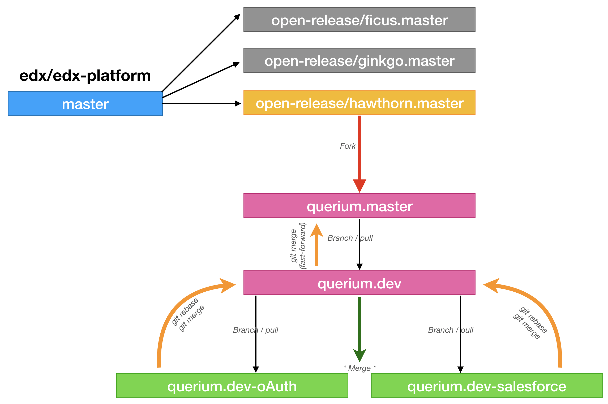

Querium  Open edX Platform Fork
This is the main edX platform which consists of LMS and Studio.

Installation / Updates (as per Lawrence McDaniel)
------------

*Add any changes to /edx/app/edx_ansible/server-vars.yml*

.. code-block:: bash

  sudo ./edx.platform-stop.sh
  sudo rm -rf /edx/app/edxapp/edx-platform
  sudo /edx/bin/update edx-platform querium.dev
  sudo ./edx.install-theme.sh
  sudo ./edx.install-config.sh
  sudo ./edx.compile-assets.sh
  sudo ./edx.platform-restart-full.sh

Custom Modules (as per Lawrence McDaniel)
------------

`Salesforce Integration Module`_: Rest api, django admin console, and manage.py command line tools to capture and upload salesforce tracking data for Open Stax marketing team.

.. _Salesforce Integration Module: cms/djangoapps/openstax_integrator

`Openstax oAuth Backend`_: A Python Social Auth backend for OpenStax, mostly used for Open edX but can be used elsewhere.

.. _Openstax oAuth Backend: https://github.com/QueriumCorp/openstax-oauth-backend

`Guide for working with Git`_: Guide for working with Git
.. _Guide for working with Git: https://www.git-tower.com/blog/git-cheat-sheet/

Git Work Flow
------------

Work with a feature branch off querium.dev
------------
.. code-block:: bash

  # how to create a new feature branch named "querium.dev-oauth" from querium.dev
  git checkout -b querium.dev-oauth querium.dev
  git branch --set-upstream-to=origin/querium.dev-oauth querium.dev-oauth

  # How to merge querium.dev-oauth modifications into querium.dev
  git checkout querium.dev
  git pull                            # to synch your local repo with remote
  git checkout querium.dev-oauth
  git pull                            # to sunch your locla repo with remote
  git rebase -i querium.dev           # rebase querium.dev-oauth to querium.dev
  git checkout querium.dev
  git merge querium.dev-oauth         # merge querium.dev-oauth into querium.dev

  # Push your changes to Github
  git push origin querium.dev
  git push origin querium.dev-oauth

Merge querium.dev into querium.master
------------
.. code-block:: bash

  git checkout querium.master
  git pull                            # to synch your local repo with remote
  git checkout querium.dev
  git pull                            # to sunch your local repo with remote
  git rebase -i querium.master        # rebase querium.dev to querium.master
  git checkout querium.master
  git merge querium.dev               # merge querium.dev into querium.master

  # Push your changes to Github
  git push origin querium.master
  git push origin querium.dev

Deployment Notes
-------
This fork will not install "cleanly" due to UI customizations that are not themeable. Because of these file modifications Paver will compile successfully only when the custom theme for this fork is also installed and configured.
Other stuff that is prone to challenges:
1. RabbitMQ initially caused problems on roverbyopenstax.com and had to be installed. Oddly, most celery tasks worked correctly. Only write operations to Mongo were problematic
2. Assets have to be compiled using our own compiler scripts, located in the config repos
3. Letsencrypt ssl certificates have to be hand replaced.
4. It's not a bad idea to search the code base and the custom theme for hard-coded domain names, as these tend to creep into the code on a regular basis.

License
-------

The code in this repository is licensed under version 3 of the AGPL
unless otherwise noted. Please see the `LICENSE`_ file for details.

.. _LICENSE: https://github.com/edx/edx-platform/blob/master/LICENSE

Documentation
-------------

Documentation details can be found in the `docs index.rst`_.

.. _docs index.rst: docs/index.rst
