# openstax_integrator: Integrations for Rover OpenStax.

[](https://github.com/agconti/cookiecutter-django-rest)

Installation
--------
1. Copy this folder into /edx/app/edxapp/edx-platform/cms/djangoapps/

2. add the following to cms.env.json
    ```
    "ADDL_INSTALLED_APPS": [
           "openstax_integrator.salesforce"
        ],
    ```
    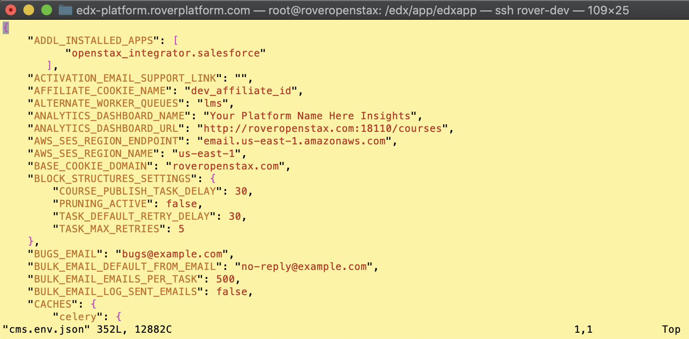

3. Add the following to /edx/app/edxapp/edx-platform/cms/urls.py on or around row 35
    ```
    urlpatterns = [
        # make this the first array entry. there will be around 75 existing entries in this array.
        url(r'^salesforce/v1/', include('openstax_integrator.salesforce.urls')),
    ```

    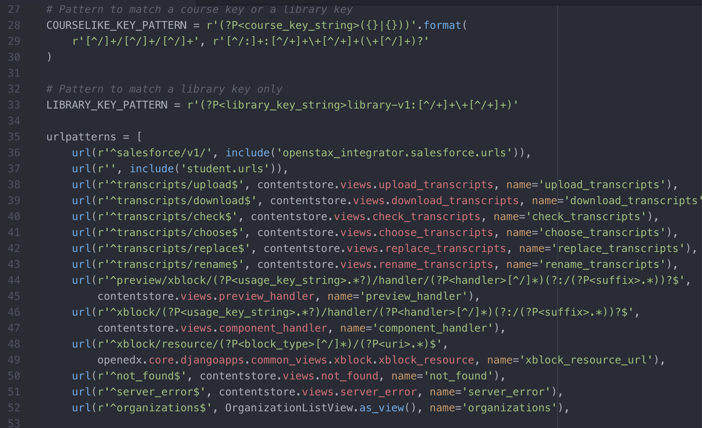

4. Run initial database migrations with this command. This is a Django thing to complete the app "registration").
    ```
    sudo -H -u edxapp -s bash
    cd ~
    source /edx/app/edxapp/edxapp_env
    python /edx/app/edxapp/edx-platform/manage.py cms makemigrations salesforce --settings=aw
    ```
    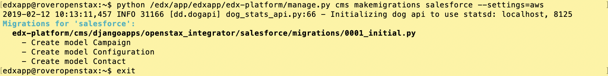


4. Run full Open edX migrations with this command from the Ubuntu command line as root
    ```
    sudo /root/edx.platform-migrations.sh
    ```
    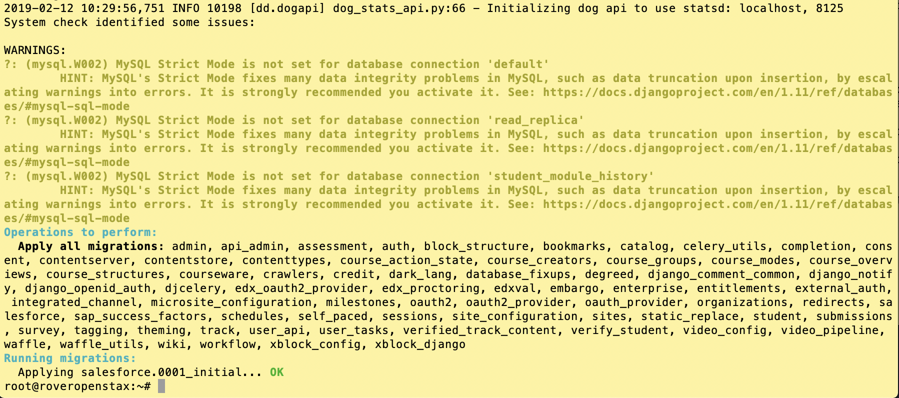

5. Add a salesforce configuration using Django Admin Console: https://am.roveropenstax.com/admin/salesforce/configuration/

    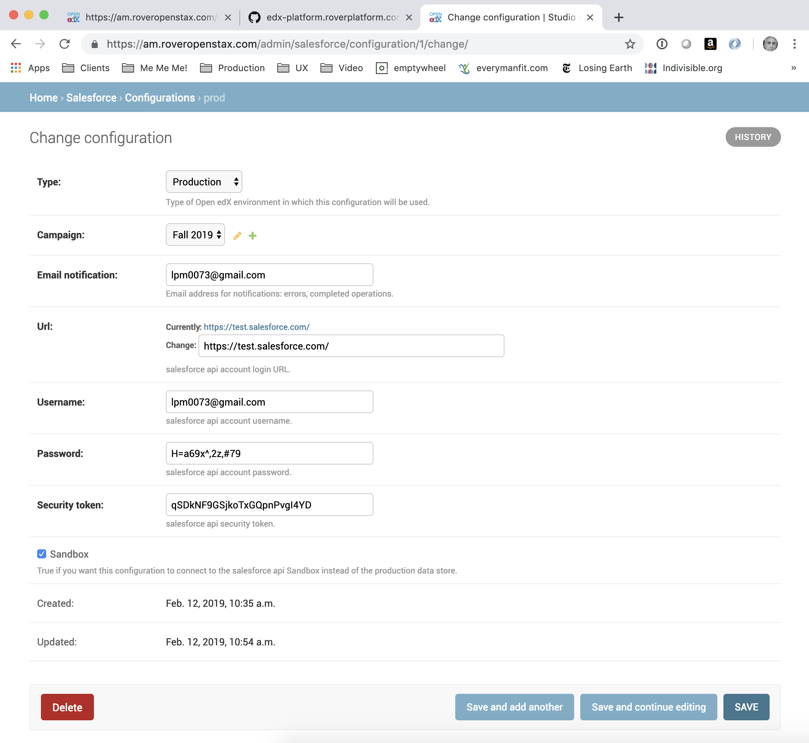


Integrations for salesforce.com
--------
Provides a REST api to extract and manage sales data on instructors. The api is read-only to Open edX staff and provide full CRUD to superusers. Also provides a command-line utility callable from manage.py that pushes instructor sales data to salesforce.com.

Runs locally (DEBUG=True) as a self-contained Django project containing all necessary replicas of Open edX models. This same project can be packaged and installed to Open edX using pip.

Permissions: access to all REST api end points are limited to authenticated users marked as "Staff".

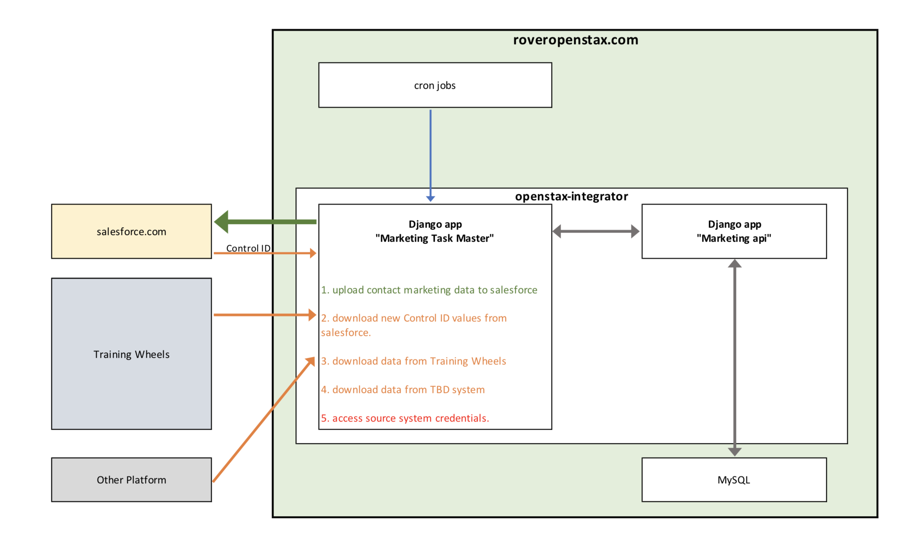
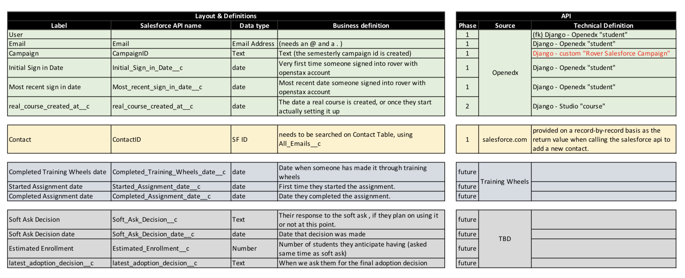


Swagger Online Documentation
--------
This module provides documentation in two formats: Django REST api "schema", and Swagger. Swagger is overwhelmingly the better option, especially is you're new to this api.

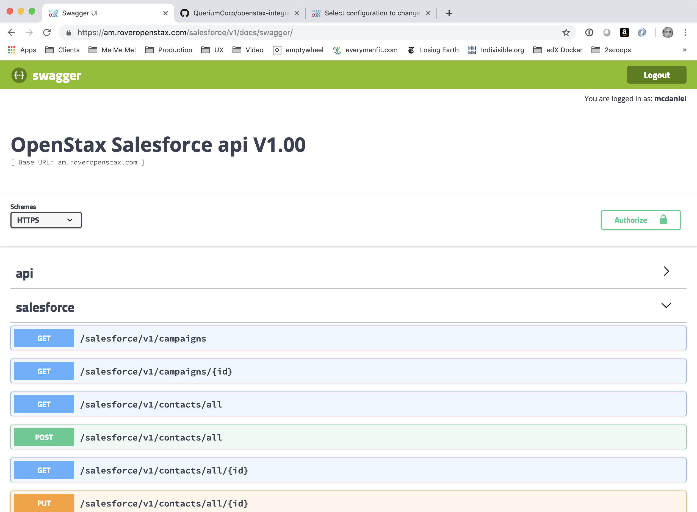
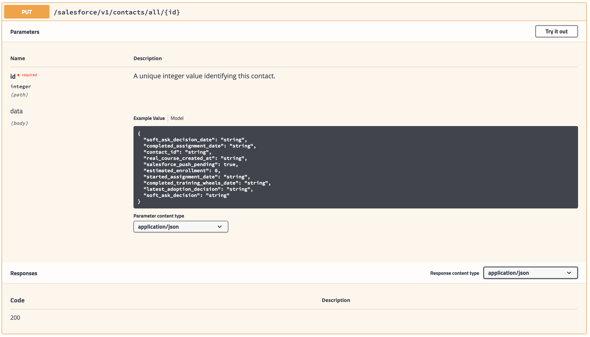


manage.py command-line utilities
--------
```
sudo -H -u edxapp bash << EOF
cd ~
source /edx/app/edxapp/edxapp_env
python /edx/app/edxapp/edx-platform/manage.py cms sfconfigtest --settings=aws   # test your Django admin Salesforce configuration parameters
EOF
```
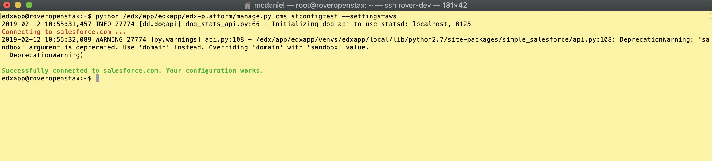


```
sudo -H -u edxapp bash << EOF
cd ~
source /edx/app/edxapp/edxapp_env
python /edx/app/edxapp/edx-platform/manage.py cms sfpull --settings=aws         # download & synch salesforce contactID values
EOF
```
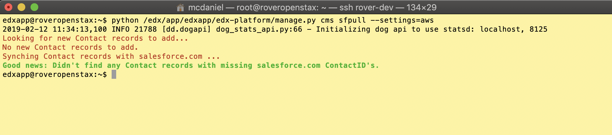


```
sudo -H -u edxapp bash << EOF
cd ~
source /edx/app/edxapp/edxapp_env
python /edx/app/edxapp/edx-platform/manage.py cms sfpush --settings=aws         # upload/update instructor "contacts" to salesforce.com
EOF
```


Django Admin console
--------
The salesforce integrations are fully maintainable from within the AM Django admin console.
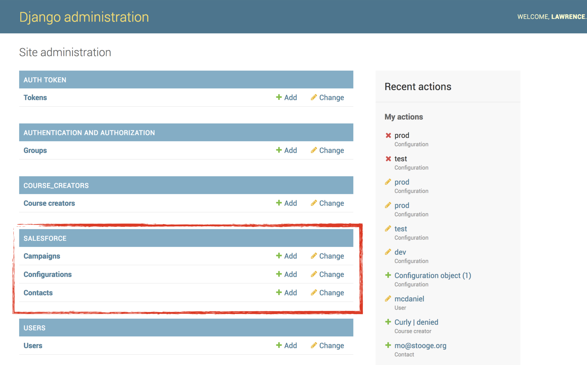

Staff and/or Super Users can perform CRUD operations on contacts (aka Instructors).
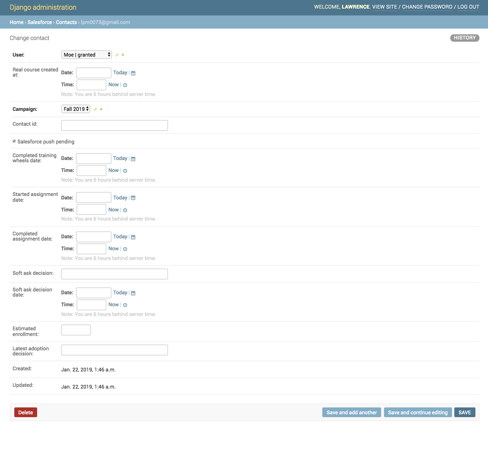

Staff and/or Super Users can manage salesforce.com connectivity data. Modifications to the salesforce.com configuration parameters take effect immediately. You can test your salesforce.com connection parameters by using the Django command line utility ```python manage.py verifyconnectivity```
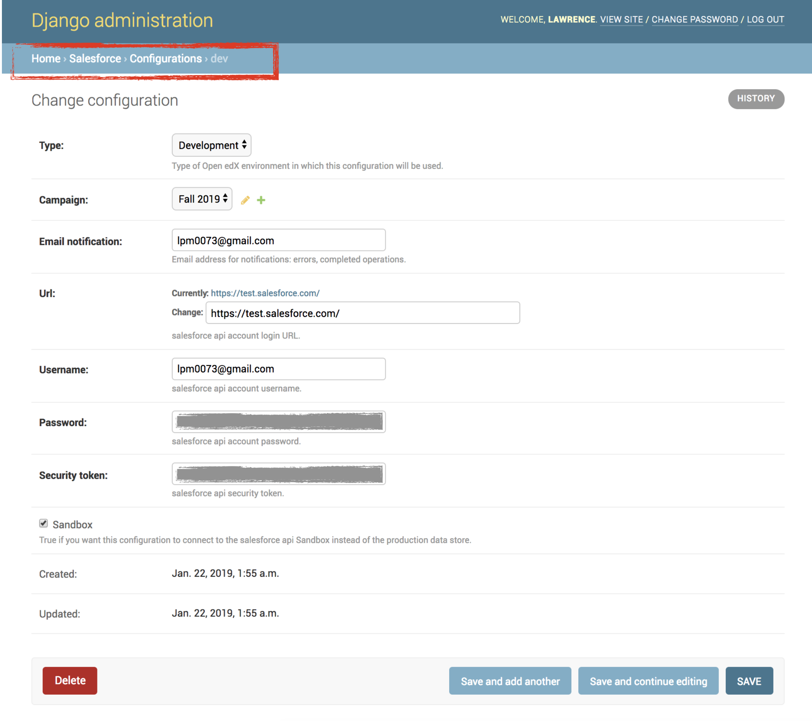
